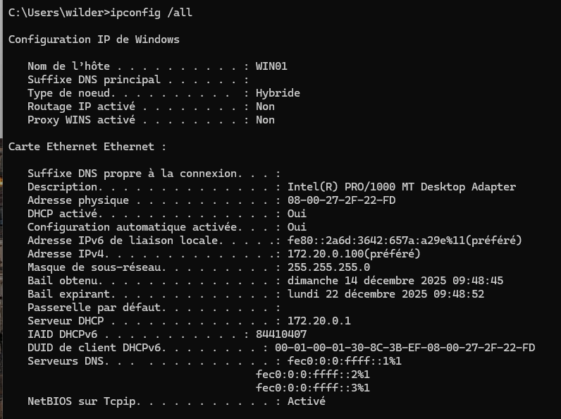

# DHCP Server — Windows Server (isc-dhcp-server)

🎯 Objectif
Mettre en place un serveur DHCP fonctionnel sous Debian capable :
- d’attribuer automatiquement des adresses IP à des clients
- de gérer une plage d’adresses DHCP
- de configurer une réservation d’adresse IP par adresse MAC

Ce laboratoire a été réalisé dans un environnement virtualisé et vise à démontrer des compétences concrètes en administration systèmes et réseaux (Windows).

---

## Captures (dans /resources/windows)
1. **Scope DHCP (serveur)**  
   

2. **Client 1 — DHCP dynamique**  
   

3. **Client 2 — IP réservée**  
   

4. **Réservation côté serveur**  
   
